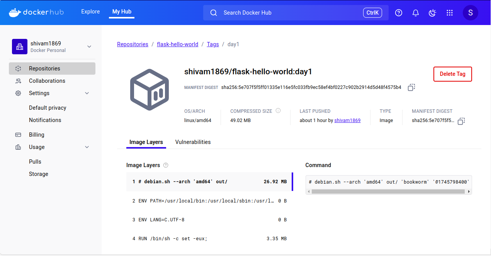

# Day 1: Docker & Kubernetes Workshop - Introduction to Docker & Containerization

## Application

A simple Flask "Hello, World!" REST API containerized using Docker.

## Docker Image

- Image Name: `shivam1869/flask-hello-world:day1`
- Docker Hub Link: https://hub.docker.com/r/shivam1869/flask-hello-world

### Core Concept Questions

1. **Why is Docker useful in building and deploying microservices for a real-world product?**

Docker provides lightweight, consistent environments for applications, making microservices easy to deploy, scale, and isolate. It enables developers to package code and dependencies together, ensuring the app runs the same everywhere—locally, in staging, or in production—greatly simplifying deployment for complex products like e-commerce or banking apps.

2. **What is the difference between a Docker image and a container in the context of scaling a web application?**

A Docker **image** is a static, read-only template that contains the application code and dependencies. A **container** is a running instance of an image — it includes the application and its environment running in isolation. When scaling, multiple containers can be created from the same image to handle increased load.

3. **How does Kubernetes complement Docker when running a product at scale?**

Kubernetes manages container orchestration at scale by automating deployment, scaling, load balancing, and recovery of containers. While Docker builds and runs containers, Kubernetes ensures hundreds or thousands of containers run smoothly across clusters, providing high availability and efficient resource management.

---

## How to Run Locally

```bash
sudo docker run -d -p 8090:8080 shivam1869/flask-hello-world:day1
```
Then open your browser and go to:
http://localhost:8090

You will see:
    Hello, World from Docker + Flask!

## Build and Push the Docker Image
**1. Build the Docker Image**
```bash
sudo docker build -t shivam/flask-hello-world:day1 .
```
This command builds the image using your local **Dockerfile** and gives it the name **shivam/flask-hello-world** with the **day1** tag.

**2. Tag the Image with Your Docker Hub Username**
```bash
sudo docker tag shivam/flask-hello-world:day1 shivam1869/flask-hello-world:day1
```
This command adds a new tag to the image, replacing **shivam** with your actual Docker Hub username **shivam1869** so it can be pushed to your Docker Hub repository.

**3. Push the Image to Docker Hub**
```bash
sudo docker push shivam1869/flask-hello-world:day1
```
This uploads your tagged image to your public Docker Hub repository:
🔗 https://hub.docker.com/r/shivam1869/flask-hello-world

**4. Pull the Image (optional test)**

You can test the image by pulling it from Docker Hub on any system:
```bash
sudo docker pull shivam1869/flask-hello-world:day1
```
This ensures your image is publicly available and working correctly.

## Docker Hub Image



The above screenshot shows the successfully pushed Docker image:  
[`shivam1869/flask-hello-world:day1`](https://hub.docker.com/r/shivam1869/flask-hello-world)
