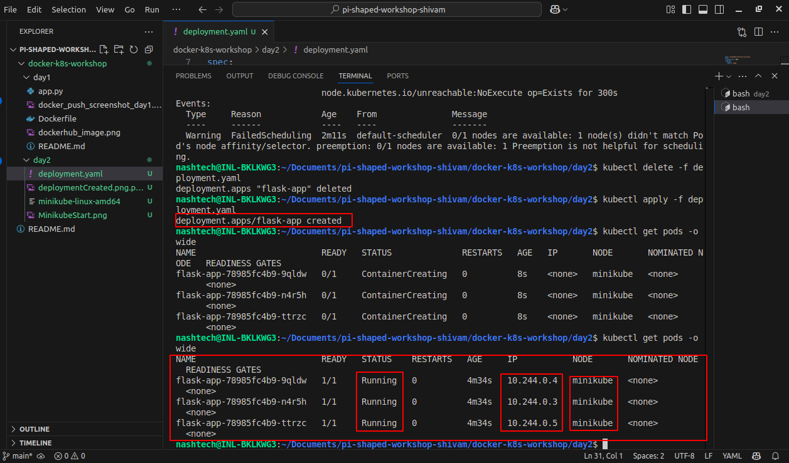

# Day 2 - Kubernetes Deployment & Service Setup

## **Overview**

In this assignment, we deployed a simple Flask web application on Kubernetes using a Deployment and exposed it via a NodePort service.  
We also explored resource requests and limits, as well as node affinity concepts.

---

## **Core Concept Questions**

### **1. Why do we set requests and limits for CPU/memory in a production-grade product?**

Setting resource requests and limits helps Kubernetes efficiently schedule pods and ensures that containers get the resources they need without affecting others.
Requests guarantee minimum resources, while limits prevent a container from consuming excessive resources, maintaining cluster stability and performance.

### **2. When would a product team apply node affinity in Kubernetes?**

Node affinity is used when pods need to be scheduled on specific nodes that meet certain criteria, like having SSDs, GPUs, or geographic constraints.
It helps optimize resource usage, improve performance, and meet compliance or architectural requirements.

---

## **Project Setup**

### **Docker Image Used**

- **Image Name:** `shivam1869/flask-hello-world:day1`
- **Docker Hub Link:** [https://hub.docker.com/r/shivam1869/flask-hello-world](https://hub.docker.com/r/shivam1869/flask-hello-world)

---

## **How to Run Locally**

1. Pull and run the Docker image:
   ```bash
   sudo docker run -d -p 8090:8080 --name flask-container shivam1869/flask-hello-world:day1
   ```
2. Open your browser and visit:
   ```bash
   http://localhost:8090
   ```

## **How to Run on Kubernetes (Minikube)**
1. Start your minikube if not running:
   ```bash
   minikube start
   ```
2. Apply the deployment manifest:
   ```bash
   kubectl apply -f deployment.yaml
   ```
3. Verify the pods are running:
   ```bash
   kubectl get pods -o wide
   ```
4. Apply the service manifest:
   ```bash
   kubectl apply -f service.yaml
   ```
5. Check service details:
   ```bash
   kubectl get service flask-service
   ```
  
6. Get Minikube IP:
   ```bash
   minikube ip
   ```
7. Open your browser with the following URL:
   ```bash
   http://<minikube-ip>:<node-port>
   ```
   Example: - http://192.168.49.2:30036

**Notes**

 -   The container listens on port 8080, and the NodePort service maps it to port 30036.

 -   Resource requests and limits are set for CPU and memory in deployment.yaml.

 -   Node affinity was experimented with but later removed due to scheduling issues on Minikube single-node cluster.


## Pods Running Image

