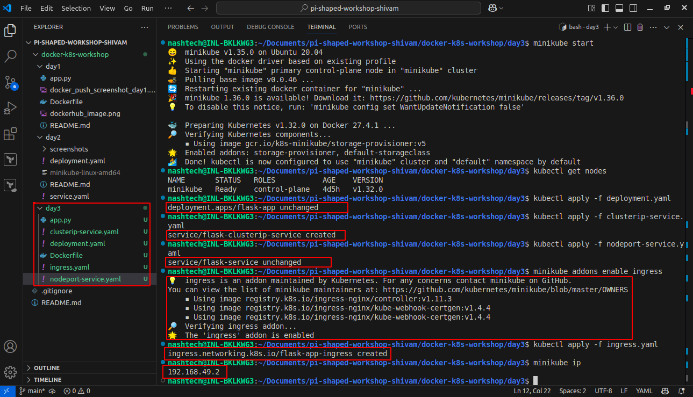
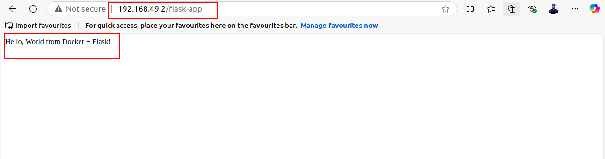
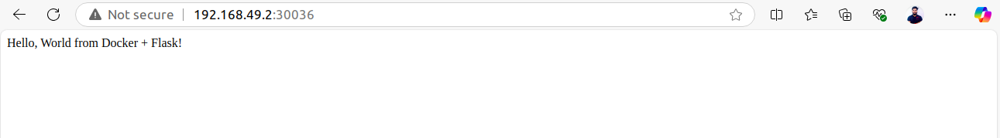

# Day 3 - Kubernetes Networking and Service Discovery

## Overview

In Day 3 of this workshop, we focused on Kubernetes networking concepts, service exposure, and service discovery. We extended the Flask app from previous days and created multiple Kubernetes service types to expose the app inside and outside the cluster. Additionally, we configured an Ingress resource to route external traffic using path-based rules.

---

## What We Did

- Used the existing Flask app container image from Day 1.
- Applied a Deployment manifest with 3 replicas of the Flask app pods.
- Created two types of Kubernetes Services:
  - **NodePort Service**: To expose the app on a static port on the Minikube node for external access.
  - **ClusterIP Service**: To expose the app internally within the cluster.
- Created an **Ingress resource** to route HTTP requests to the app using a path-based rule.
- Tested the application accessibility via NodePort and Ingress URLs.
- Documented the setup and captured screenshots for verification.

---

## Files and Their Roles

| File                   | Description                                                                                 |
|------------------------|---------------------------------------------------------------------------------------------|
| `app.py`               | Flask application code handling HTTP requests and responses.                               |
| `Dockerfile`           | Builds the Docker image for the Flask app.                                                |
| `deployment.yaml`      | Defines the Deployment with 3 replicas of the Flask app pods.                             |
| `nodeportservice.yaml` | Exposes the Flask app externally via a NodePort service on port 30036.                    |
| `clusteripservice.yaml`| Exposes the Flask app internally inside the cluster via ClusterIP service.                |
| `ingress.yaml`         | Configures Ingress resource to route external traffic on path `/flask-app` to the service. |

---

## Core Concept Questions

**1. How would you expose an internal microservice (e.g., user-auth) differently than a public-facing frontend in a Kubernetes-based product?**

- Internal microservices like user-auth are typically exposed using **ClusterIP services**, making them accessible only inside the cluster to other services or pods, enhancing security and isolation.
- Public-facing frontends are exposed using **NodePort, LoadBalancer services, or Ingress** to allow external client access via public IPs or domain names.

---

**2. Why might a product use Ingress instead of directly exposing each microservice via LoadBalancer?**

- Ingress allows managing access to multiple services via a single external IP and hostname, with path- or host-based routing rules.
- It reduces the number of external IPs needed, lowering costs and simplifying DNS management.
- Ingress can also provide SSL termination, authentication, and centralized traffic control, which individual LoadBalancers cannot efficiently provide.
- LoadBalancer services are costly and sometimes unavailable on local clusters like Minikube, making Ingress the preferred choice for flexible traffic routing.

---


## **Project Setup**

### **Docker Image Used**

- **Image Name:** `shivam1869/flask-hello-world:day1`
- **Docker Hub Link:** [https://hub.docker.com/r/shivam1869/flask-hello-world](https://hub.docker.com/r/shivam1869/flask-hello-world)

---

---

## How to Test

1. Apply Deployment:
   ```bash
   kubectl apply -f deployment.yaml
   ```

2. Apply Services:
    ```bash
   kubectl apply -f nodeportservice.yaml
   kubectl apply -f clusteripservice.yaml
   ```
   
3. Apply Ingress:
   ```bash
   kubectl apply -f ingress.yaml
   ```
4. Access app using:
  - NodePort URL: http:// minikube-ip :30036/
  - Ingress URL: http:// minikube-ip /flask-app
  
   Example:
   Run command:
   ```bash
   minikube ip
   ```
  Output:
   ```bash
   192.168.49.2
   ```
   Access the app at: http://192.168.49.2/flask-app

---

## Screenshots

- Deployment, Services, and Ingress applied successfully in Minikube:
  

- Application accessed successfully via Ingress URL:
  
  
- Application accessed successfully via NodePort URL:
  
