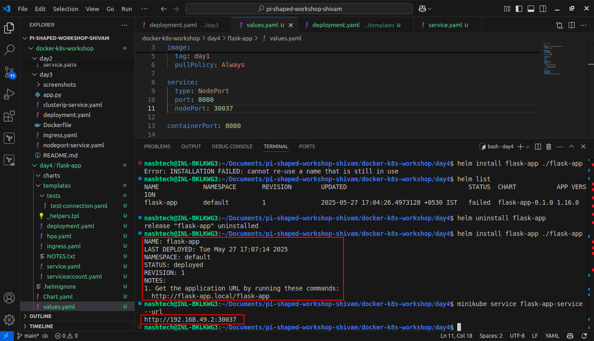
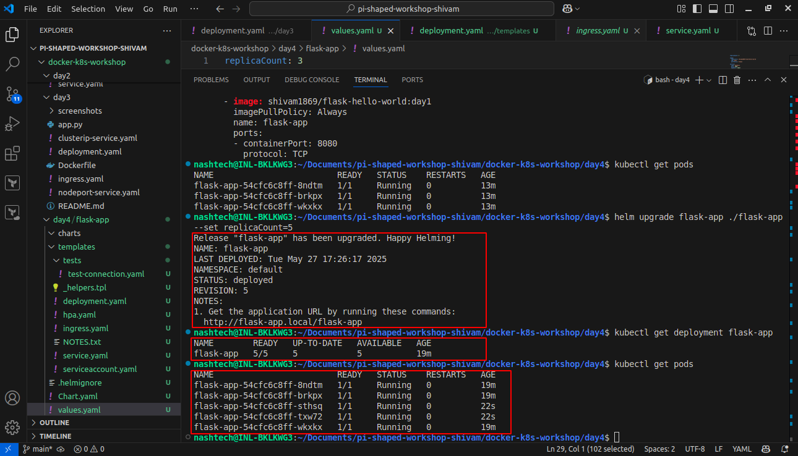

# Day 4 - Helm Packaging & Deployment

## Overview

In Day 4 of this workshop, we explored **Helm**, the package manager for Kubernetes. We learned how to convert Kubernetes manifests into reusable Helm charts, parameterize deployments, and manage application lifecycle using Helm commands. We extended the same Flask app and deployed it using Helm with customizable configurations via `values.yaml`.

---

## What We Did

- Created a Helm chart named `flask-app` from existing Kubernetes manifests.
- Parameterized values such as:
  - Image name and tag
  - Container and service port
  - Replica count
- Installed the application using Helm with `helm install`.
- Upgraded the replica count using `helm upgrade` from 3 to 5.
- Verified the running pods and deployment with `kubectl`.
- Captured screenshots of installation and upgrade commands for assignment submission.

---

## Files and Their Roles

| File/Folder                                      | Description                                                                 |
|--------------------------------------------------|-----------------------------------------------------------------------------|
| `flask-app/Chart.yaml`                           | Contains metadata about the Helm chart (name, version, etc.).              |
| `flask-app/values.yaml`                          | Parameterized configuration values (image name, port, replica count).      |
| `flask-app/templates/deployment.yaml`            | Template for the Kubernetes Deployment manifest.                           |
| `flask-app/templates/service.yaml`               | Template for the Kubernetes Service manifest.                              |
| `flask-app/templates/ingress.yaml`               | Template for the Kubernetes Ingress resource.                              |
| `screenshots/helm_install_success.png`           | Screenshot showing `helm install` success.                                 |
| `screenshots/helm-upgrade-replicas.png`          | Screenshot showing `helm upgrade` to increase replica count.               |
| `.helmignore`                                    | Lists files/directories to ignore when packaging the chart.                |
| `README.md`                                      | This file, containing full documentation and core questions.               |

---

## Core Concept Questions

**Q1: Why is Helm important for managing configuration across different environments in a real-world product (e.g., dev, staging, prod)?**

Helm enables templating and parameterization of Kubernetes manifests, which makes it easy to deploy the same application across multiple environments with different configurations. For instance, you can maintain a single Helm chart and override values such as image tags, replica counts, or environment-specific variables using different **values.yaml** files or CLI arguments — greatly reducing duplication and error-prone manual changes.

---

**Q2: How does Helm simplify deployment rollback during a production incident?**

Helm maintains a revision history of every installation and upgrade. If a deployment breaks due to a bad image or config during an upgrade, Helm allows you to rollback to a previous stable release using a single command:

   ```bash
   helm rollback < release-name > < revision-number >
   ```
   This makes incident recovery fast, reliable, and minimizes downtime.

---

## **Project Setup**

### **Docker Image Used**

- **Image Name:** `shivam1869/flask-hello-world:day1`
- **Docker Hub Link:** [https://hub.docker.com/r/shivam1869/flask-hello-world](https://hub.docker.com/r/shivam1869/flask-hello-world)


---

## Installation & Upgrade Steps

**1. Install Helm (if not already installed)**

   On Ubuntu or Debian-based systems, you can install Helm using Snap:
   ```bash
   sudo snap install helm --classic
   ```

**2. Package the Helm Chart**
   ```bash
   helm package .
   ```
   This creates a .tgz Helm chart archive (e.g., `flask-app-0.1.0.tgz`).
   
**3. Install the Helm Chart**
   ```bash
   helm install flask-app ./flask-app
   ```
This deploys the app to your Kubernetes cluster using values from `values.yaml`.
You can verify the deployment and pods with:
   ```bash
    kubectl get deployment
    kubectl get pods
   ```
**4. Upgrade the Release (Change Replica Count)**
  
  To scale the app from 3 to 5 replicas, modify the `replicaCount` in `values.yaml`:
   ```bash
   kubectl get pods
   ```
Then upgrade the deployment with:
   ```bash
   helm upgrade flask-app-release ./flask-app
   ```
Verify the updated pods:
   ```bash
   kubectl get pods
   ```
**5. Optional: Rollback (in case of issue)**

Helm supports easy rollback:
   ```bash
   helm rollback flask-app-release 1
   ```
Replace `1` with the desired revision number as needed.

## Screenshots

- Helm installation success:
  

- Helm upgrade to scale replicas from 3 to 5:
  
